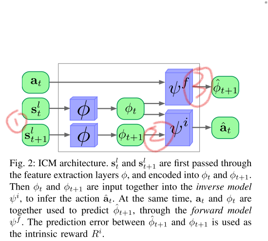

# Curiosity-driven Exploration for Mapless Navigation with Deep Reinforcement Learning

[TOC]

```latex
@article{Curiosity-driven ,
  author    = {Oleksii Zhelo and
               Jingwei Zhang and
               Lei Tai and
               Ming Liu and
               Wolfram Burgard},
  title     = {Curiosity-driven Exploration for Mapless Navigation with Deep Reinforcement
               Learning},
  journal   = {CoRR},
  volume    = {abs/1804.00456},
  year      = {2018},
  url       = {http://arxiv.org/abs/1804.00456},
  archivePrefix = {arXiv},
  eprint    = {1804.00456},
  timestamp = {Wed, 10 Oct 2018 16:58:35 +0200},
  biburl    = {https://dblp.org/rec/bib/journals/corr/abs-1804-00456},
  bibsource = {dblp computer science bibliography, https://dblp.org}
}
```


## Methods

#### Extrinsic Reward

$$
R_t^e = r_t + \lambda^p r_t^p + \lambda ^\omega r_t^ \omega
$$

其中，$r_t​$ 代表了一般的reward，$p_t​$ 是agent's pose， g 代表 goal，$\lambda^p​$ 与$\lambda^{\omega}​$都是scaling factors
$$
r_t =\left \{ \begin{array}{ll}
r_{reach}, & {if~reaches~goal}, \\
r_{collision}, & {if~collides}, \\
\lambda^g (||p_{t-1}^{x,y} - g||_2 - ||p_{t}^{x,y} - g||_2) & otherwise. \\	\end{array} \right.
$$
$r_t ^p$ position-based penalties 基于位置的惩罚
$$
r_t^p =
\left  \{ \begin{array}{ll} 
r_{position}, & {if~||p_{t-1}^{x,y} - p_t^{x,y} ||_2 = 0} ,\\
0, & otherwise. \\  
\end{array} \right.
$$
$r_t^{\omega}$ represents orientation-based penalties 基于方位角的惩罚
$$
r_{t}^{\omega}=\left\|\operatorname{atan} 2\left(\mathbf{p}_{t}^{y}-g^{y}, \mathbf{p}_{t}^{x}-g^{x}\right)-\mathbf{p}_{t}^{\omega}\right\|_{1}
$$


#### Intrinsic Reward

通过以好奇心衡量的内在动机来鼓励探索

采用了ICM(Intrinsic Curiosity Module)去measure intrinsic reward

- $s_t^l​$ and $s_{t+1}^l​$ passed through $\phi​$  --> encode -->   $\phi _t ​$ and $\phi_{t+1}​$
-   $\psi ^i​$ predict $\hat a_t​$  from   $\phi _t ​$ and $\phi_{t+1}​$  **(inverse model)**
  - trained from cross-entropy loss from ground truth $a_t​$
- $\psi ^f​$ predicts $\hat \phi _{t+1} ​$ from $ \phi _t ​$ and $ a_t​$  **(forward model)**
  - mean squared error loss with the ground truth $ \phi _{t+1} $
- $\phi   ~~~ \psi ^i~~~\psi ^f​$  are learned and updated together with the actor-critic parameters $\theta ^\pi​$
- 总的优化目标是

$$
\min _{\theta_{\phi}, \theta_{\psi_{f}}, \theta_{\psi_{i}}}\left(\left(1-\lambda^{f}\right)\left(-\sum_{j=1}^{3} \mathbf{a}_{j} \log \hat{\mathbf{a}}_{j}\right)+\lambda^{f} \frac{1}{2}\left\|\hat{\phi}_{t+1}-\phi_{t+1}\right\|_{2}^{2}\right)
$$

第一部分与反向模型训练有关*（??? 交叉熵，用来训练）*

第二部分是正向模型训练有关，预测的误差

*（看起来是交叉训练，通过这样把 $\phi _t $  和  $ a_t$ 之间函数与反函数找到）*

均赋予特征提取层

- 逆向模型用来从state中提取有用的信息预测action
- 正向模型用来鼓励提取更好的能预测的特征嵌入*（如何从action中？？？）*

**$\lambda^{f}$ 用来调节权重使得模型不会只学所有状态的共同特征**

> Both of these influences, however, help to exclude environmental factors which are unaffected by and do not affect the agent, so it would not stay constantly curious of irrelevant or inherently unpredictable details of the environment.

intrinsic reward $R^i​$
$$
R^{i}=\frac{1}{2}\left\|\hat{\phi}_{t+1}-\phi_{t+1}\right\|_{2}^{2}
$$
采用预测值 $\hat \phi _{t+1} $（从action预测）与$\phi_{t+1}​$ （用CNN从states中得到）的均方误差来定义内在奖励*（这里是为什么？？误差如何和奖励挂钩？不清楚这两者之间有什么联系）* 

$$
R = R^e + \lambda^i R^i
$$