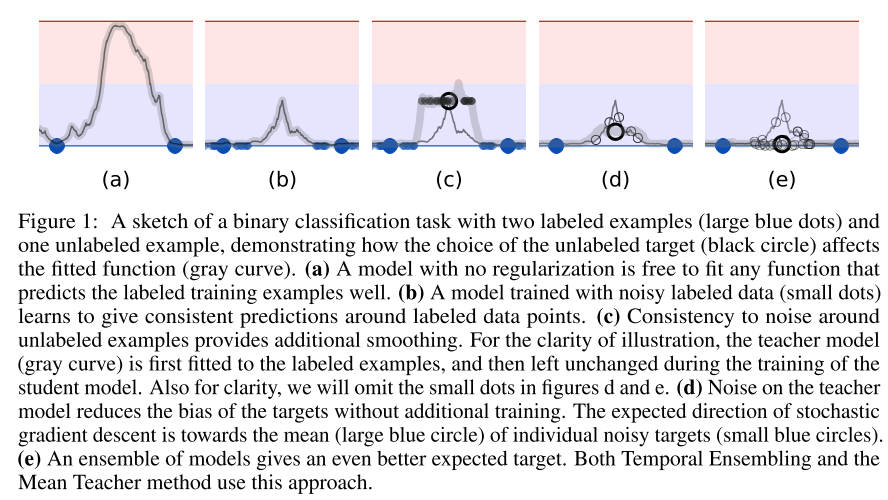
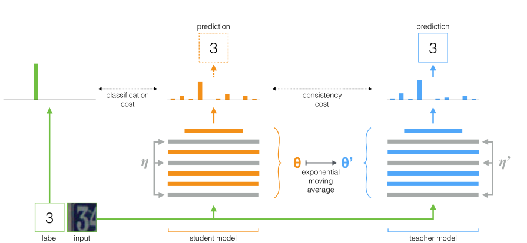

# Mean teachers are better role models: Weight-averaged consistency targets improve **semi-supervised deep learning** results
```latex
bibtex here
```

## 摘要部分

TE方法*在每个训练示例上保持标签预测的指数移动平均线, 并惩罚与此目标不一致的预测。* 大数据量的时候TE方法过于笨重。提出了Mean-Teacher方法，测试更加准确，而且准确，用到的标签更少

## Intro/Related work

尽管被识别的物体有微小改变，模型也应该能够给出一致的输出。 为了实现这个目标，主要有两种方法：

1. 加噪声

   - 一般是输入层

   - 也可以加中间层，这种想法激发了很多正则化技术

     > To enable the model to learn more abstract invariances, the noise may be added to intermediate representations, an insight that has motivated many regularization techniques, such as Dropout [27].

   - 正则化模型最小化每个数据点周围流形的成本，来决策边界从标记的数据点上推离，而不是最大限度地降低输入空间的零维数据点的分类成本

     > Rather than minimizing the classification cost at the zero-dimensional data points of the input space, the regularized model minimizes the cost on a manifold around each data point, thus pushing decision boundaries away from the labeled data points (Figure 1b).
     > 

   - 对于未标记的示例，由于未定义分类成本，噪声正则化没用；（仅对标记过的有用）

2. 提出$\Gamma$ model : 评估每个数据点加不加噪声的情形，然后应用consistency cost 

   1. 这种模型可以被类比为教师和学生
   2. 老师生成 target
   3. 学生学

3. 问题：target 不准，而且target比重过大学生学不到新东西

4. 两种解决办法

   - 仔细选噪声（类型、作用方式，不仅仅是高斯噪声加法乘法）
   - 仔细选老师（别和学生一样）
   - 这两种方式可以共同作用

## 模型

### Pre 

1. softmax 通常不能提供准确预测，因此在 inference time 加噪声来缓解
   （为什么说嘈杂的老师可以产生更准确的目标？）

   Pseudo-Ensemble Agreement   &  $\Pi​$ model

   

2.  $\Pi$ model + Temporal Ensembling (include EMA 指数滑动平均)
   提高了质量 --> 由早期版本生成预测

   缺点： 更新缓慢，使用TE 计算量是$O(n^2)$

### Main

克服TE的缺点，使用平均模型权重（而并非预测）



学生网络用gradient descent 更新，教师网络用学生网络的 EMA 更新
$$
{\bf EMA}\\
~\\
\theta_{t}^{\prime}=\alpha \theta_{t-1}^{\prime}+(1-\alpha) \theta_{t}
$$
（有点类似DDPG里面的更新方式，soft更新）

区别：$\theta^{\prime}$ 作为常量（TE也是常量，$\Pi$ 还训练了这个参数）

使用 MSE（均方根误差）作为consistency cost