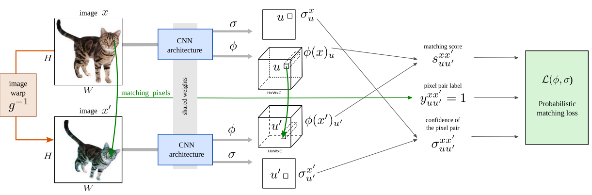

# Self-supervised Learning of Geometrically Stable Features Through Probabilistic Introspection

```latex
bibtex required
```

## Abstract

> While self-supervision has usually been considered for tasks such as image classification, in this paper we aim at extending it to geometry-oriented tasks such as semantic matching and part detection

本文将图像分类领域的self-supervision （自监督）拓展到了面向几何的任务，即语义匹配和目标的部分检测。这个方法通过合成图像变换，从未标记的图像中学密集的视觉描述符（dense distinctive visual descriptors）

## 方法

### 问题背景/目的任务

> Our aim is to learn a neural network for object part detection and semantic matching. Furthermore, we assume that only a small number of images annotated with information relevant to these tasks is available, but that images labeled only with the presence of a given object category are plentiful. 

学一个能检测部分目标，而且进行semantic matching 的neural network， 但是只有一小部分全标记的图像，大部分图像只标注了类别。 因此需要让我们的model 可以 **自监督** + **使用图像信息去捕捉类别**

### 符号说明

| 符号                                                         | 含义                                                   |
| :----------------------------------------------------------- | ------------------------------------------------------ |
| $\mathcal{X}=\left\{\mathbf{x}_{1}, \ldots, \mathbf{x}_{N}\right\}$ | 某一类未标记图像的集合                                 |
| $\phi : \mathbb{R}^{H \times W \times 3} \rightarrow \mathbb{R}^{H \times W \times C}$ | 神经网络，用来从图像中提取特征 dense set               |
| $\phi(\mathbf{x})_{u} \in \mathbb{R}$                        | 在位置 u 处图像 x 的特征；可以认为是描述符(descriptor) |
| $\sigma_{u}^{\mathrm{x}} \in \mathbb{R}^{+}$                 | 神经网络，用来预测特征匹配是否不可靠                   |
|                                                              |                                                        |

### 模型解读

#### Invariant description

不变性

原图$\mathbf{x}​$ 和变换后图像 $\mathbf{x^{\prime}}​$ 的相同特征$u​$   $u^\prime​$  通过CNN提取之后应该有同样的输出$\phi(\mathbf{x})_{u} ​$
$$
\phi(\mathbf{x})_{u}=\phi\left(\mathbf{x}^{\prime}\right)_{u^{\prime}}
$$
如何获得 $\mathbf{x^{\prime}}$ ？ 定义一个变换 $\mathbf{x}^{\prime}=\mathbf{x} \circ g^{-1}$  ，$g^{-1}$是一个任意的图像变换

问题来了：如果我们按照这个规则去训练神经网络，那么它会变成一个全等形式，使得所有的描述符(descriptor)都是一样的。我们需要添加其它的约束关系，这关系就是让我们的每个描述符唯一的描述一个object point

#### Informative invariant description

上一节定义的不变性需要满足一个条件， 即可以鲁棒的区分不同的object point

作者发现没有必要确切的检查上面的这个等式是否严格成立，所以换了一个思路，可以使用内积去描述。这样定义一个matching score
$$
s_{u u^{\prime}}^{\mathbf{x} \mathbf{x}^{\prime}}=\max \left\{0,\left\langle\phi(\mathbf{x})_{u}, \phi\left(\mathbf{x}^{\prime}\right)_{u^{\prime}}\right\rangle\right\}
$$
为了*最大化*（？？？）这个描述符，需要满足的条件是
$$
s_{u u^{\prime}}^{\mathbf{x} \mathbf{x}^{\prime}} \leq 1, ~~~s_{u u}^{\mathbf{x x}}=1
$$
（与自身的matching score 定为1）需要进行归一化处理，使用$L^2$ 正则化
$$
\left\|\phi(\mathbf{x})_{u}\right\|_{2}=1
$$

> The inner product is rectified because, while it makes sense for similar descriptors to be parallel, dissimilar descriptors should be orthogonal rather than anti-correlated.
>
> (为什么不同的描述符应该是正交的而不是反相关的？？？)

#### Encode invariance and discriminability together

根据 $u$ 和 $u^\prime$ 是否表征一个有效的关联(valid correspondence)，定义label 来描述二者是否相关
$$
y_{u u^{\prime}}^{\mathrm{xx}^{\prime}} \in\{-1,0,+1\} \\~\\
y_{u u^{\prime}}^{\mathrm{xx}^{\prime}} = \left\{ \begin{array}{ll} 1 & \text{valid correspondence} \\ 0 & \text{borderline case to be ignored} \\ -1 & \text{invalid correspondence}\end{array}\right.
$$
这个label 的取值规则为
$$
y_{u u^{\prime}}^{g}=\left\{\begin{array}{ll}{1,} & {\left\|u^{\prime}-g(u)\right\|_{2} \leq \tau_{1}} \\ {0,} & {\tau_{1}<\left\|u^{\prime}-g(u)\right\|_{2} \leq \tau_{2}} \\ {-1,} & {\text { otherwise }}\end{array}\right.
$$
这里的 $\tau_1 = 1 \text{ pixels},~~ \tau_2 = 30\text{ pixels}$  是一个人为给定的匹配阈值

（？？？）

通过label 定义matching loss
$$
\ell_{u u^{\prime}}^{\mathbf{x x}^{\prime}}=\left\{\begin{array}{ll}{1-s_{u u^{\prime}}^{\mathbf{x} \mathbf{x}^{\prime}}} & {y_{u u}^{\mathbf{x} \mathbf{x}^{\prime}}=1} \\ {0} & {y_{u u^{\prime}}^{\mathbf{x x}^{\prime}}=0} \\ {s_{u u^{\prime}}^{\mathbf{x x}^{\prime}}} & {y_{u u^{\prime}}^{\mathbf{x x}^{\prime}}=-1}\end{array}\right.
$$
但是 这个是远远不够的，因为会出现遮挡和太难匹配特征的情况，因此需要解决这个问题

#### Probabilistic introspection

概率内省？？？

作者没有从启发式算法入手解决这个问题（使用更加鲁棒的loss function）， 而是定义了一个 uncertainty $\sigma^\mathbf{x}_u$ 来决定描述符何时**不可靠**

> In this manner,  $\sigma^\mathbf{x}_u$  can be interpreted as an assessment of the informativeness of the image region that is used to compute the descriptor.
>
> 它可以被解读为用来计算描述符的区域的**信息量评估** （怎么理解？？？）

对于两个图像，使用它们的平均值（为简写没有加x）
$$
\sigma_{u u^{\prime}}=\left(\sigma_{u}+\sigma_{u^{\prime}}\right) / 2
$$
定义了概率函数
$$
p\left(s_{u u^{\prime}} | y_{u u^{\prime}}, \sigma_{u u^{\prime}}\right)=\frac{1}{\mathcal{C}\left(\sigma_{u u^{\prime}}\right)} \exp \frac{1-\ell_{u u^{\prime}}\left(s_{u u^{\prime}}, y_{u u^{\prime}}\right)}{\sigma_{u u^{\prime}}}
$$
这里$\mathcal{C}\left(\sigma_{u u^{\prime}}\right)​$是归一化引入的常量，$\sigma_{u u^{\prime}}​$ 描述区域对 $u​$ 和 $u^\prime​$  是否可靠，$ 1-\ell_{u u^{\prime}}\left(s_{u u^{\prime}}, y_{u u^{\prime}}\right)​$ 描述区域对相关程度

这样做的好处有

1. > When the model is confident in the quality of both descriptors $\phi(\mathbf{x})_{u}$ and $\phi(\mathbf{x}^\prime)_{u^\prime}$ , the value $\sigma_{u u^{\prime}}$ is small. In this case, the distribution has a sharp peak around 1 or 0, depending on whether pixels ($u$, $u^{\prime}$) are in correspondence or not.

2. > On the other hand, when the model is less certain about the quality of the descriptors, the score distribution is more spread.


### Learning Objective

Loss function
$$
\mathcal{L}(\phi, \sigma)= \frac{1}{|\mathcal{X}|} \sum_{\mathbf{x} \in \mathcal{X}} \mathbb{E}_{g, u, u^{\prime}} \left[-\log p\left(s_{u u^{\prime}}^{\mathbf{x}, \mathbf{x} \circ g^{-1}}(\phi) | y_{u u^{\prime}}^{g}, \frac{\sigma_{u}^{\mathbf{x}}+\sigma_{u^{\prime}}^{\mathbf{x o g}^{-1}}}{2}\right) \right]
$$
通过最小化loss function 来更新neural network $\phi​$ 和 $ \sigma ​$ 

### 模型概念图



### 其它

- 变换中还使用了仿射变换

- 为了避免边界问题，使用了镜像填充

  > To avoid border artifacts, following [29], we mirror-pad each image enlarging its size by a factor of two while biasing the sampled transformations towards zooming into the padded image. 

- 将图像分别变换两次作为两个输入

  > In order to avoid potential trivial solutions due to keeping the first image x unwarped (as the network can catch subtle artifacts induced by warping), we sample two transformations $\hat{g} $, $\hat{g^\prime}$ and then warp the original input image $\mathbf{\hat{x}}$ twice to form the input image pair.

- 生成随机的颜色和光照变换

  > While random affine warping makes our features invariant to the geometric transformations, a successful representation should be also invariant to intraclass appearance variations caused by e.g. color and illumination changes.


（疑问？？？

- 关于最后的损失函数，解出来之后是线性的，指数与对数相消，为什么不直接定义成线性的，或是否线性就更优？

）