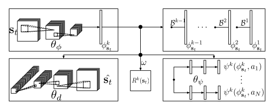

# Successor Features

#### **Deep Reinforcement Learning with Successor Features for Navigation across Similar Environments**

- Only rely on its onboard      sensors to perform the navigation task without explicit localization,      mapping and path planning procedures

- A successor-feature-based DRL  algorithm

  - To solve the problem that  can't quickly adapt to new situation
  - To make the model transfer  aims to  directly tie the learned       representation between tasks

- Inputs:

  - Both visual and depth
  - CNNs

- Successor feature

  - Reward function can be approximately represented ad a linear combination of learned feature
    $$
    \begin{aligned} Q(\mathbf{s}, \mathbf{a} ; \pi) & \approx \mathbb{E}\left[\sum_{t=0}^{\infty} \gamma^{t} \phi\left(\mathbf{s}_{t} ; \theta_{\phi}\right) \cdot \omega | \mathbf{s}_{0}=\mathbf{s}, \mathbf{a}_{0}=\mathbf{a}, \pi\right] \\ &=\mathbb{E}\left[\sum_{t=0}^{\infty} \gamma^{t} \phi\left(\mathbf{s}_{t} ; \theta_{\phi}\right) | \mathbf{s}_{0}=\mathbf{s}, \mathbf{a}_{0}=\mathbf{a}, \pi\right] \cdot \omega \\ &=\psi^{\pi}(\mathbf{s}, \mathbf{a})^{T} \omega \end{aligned}
    $$

  - the successor representation natually decouples **task specific reward estimation** and the **estimation of the expected occurrece of the features** $\phi(\cdot)$ under the specific policy dynamics

  - lends itself well to transfer learning in secnarios of the 2 kinds of squence of RL problems

    - 1. different environment, same reward function
      2. different environment, different reward function (need to be extended(but with minimal additional memory and computational requirement))

- Simulated experiments

  - 1st, test in 3d environment contains cubic objects and a target for the agent to reach
  - 4 discrete choices: {stand still, turn left (90◦), turn right (90◦), go straight (1m)}
  - agent is a simulated Pioneer-3dx robot moving under a differential drive model (with Gaussian control noise)
  - FOR TRAINING the SF-RL model : SGD with Adam optimizer
  - 
  - train a CNN by SL to directly predict the actions computed by an A* planner from the same visual input that SF-RL receieves
  - train a DQN
  - Experiment:
    - train SF-RL DQN-FixFeature DQN-Finetune CNN
    - transfer to different envrionment

## 摘要部分

### 研究问题

> Robot navigation in **simple maze-like environments** where only relies on on board sensors

### 出发

#### 传统：SLAM方法

**Drawbacks**

> The majority of SLAM solutions are implemented as *passive procedures* relying on special exploration strategies or a human controlling the robot for sensory data acquisition.(大多数 SLAM 解决方案都是作为被动程序实现的, 依靠特殊的探索策略或人类控制机器人进行感官数据采集。)

> They require an expert to check as to whether the obtained map is accurate enough

#### 本文的目的

> Our goal in this paper is to make first steps towards a solution for navigation tasks without explicit localization, mapping and path planning procedures.

因此作者引入RL

但是：**原来的RL方法都对于迁移到新问题中都太慢了**（估计是需要重新训练）

​	原因？**不满足某个先决条件**（啥？）

所以这个 model 可以自然迁移到序列任务中，并且最小额外损失

> This formulation can be extended to handle sequential task transfer naturally, with minimal additional computational costs

所以需要让模型迁移的更快，使Model能在不同的迷宫中通行，输入不仅仅是visual的，还需要depth的，可以确认CNN的良好效果

> In addition, we validate that deep convolutional neural networks (CNNs) can be used to imitate conventional planners in our considered domain.

## 相关工作

- value-based RL in combination with Deep neural networks 
  Deriving extended variants （生成很多变体）

  > A neural network trained using Q-learning on a specific task is expected to learn features that are informative about both: 
  >
  > 1. the dynamics induced by the policy of the agent in a given environment (we refer to this as the policy dynamics in the following text)
  >
  > 2. the association of rewards to states
  >
  > These two sources of information cannot be assumed to be clearly separated within the network.
  >
  >
  > 更确切地说, 尽管在特定任务上使用 q 学习训练的神经网络有望学习有关这两个方面的信息的功能: 
  >
  > 1. 代理在给定环境中的策略所诱导的动态 (我们将此称为特定环境中的策略动态）
  > 2. reward和states 之间的联系
  >
  > 这两个信息来源不能被认为是在网络内明确分开的。
  >
  > 目前尚不清楚如何以保持原任务policy完整的方式转让上述知识

- 目前尚不清楚如何以保持原任务policy完整的方式转让上述知识
  

尝试：

1. > One attempt at **clearly separating reward** attribution for different tasks while learning a shared representation is the idea of learning a general (or universal) value function [14] over many (sub)-tasks that has recently also been combined with DQN-type methods

