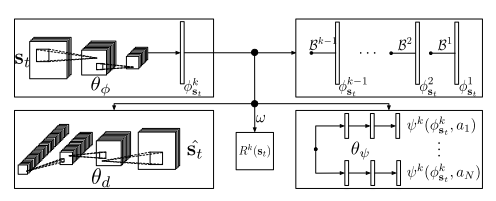

# Successor Features

[TOC]

#### **Deep Reinforcement Learning with Successor Features for Navigation across Similar Environments**

- Only rely on its onboard      sensors to perform the navigation task without explicit localization,      mapping and path planning procedures

- A successor-feature-based DRL  algorithm

  - To solve the problem that  can't quickly adapt to new situation
  - To make the model transfer  aims to  directly tie the learned       representation between tasks

- Inputs:

  - Both visual and depth
  - CNNs

- Successor feature

  - Reward function can be approximately represented ad a linear combination of learned feature
    $$
    \begin{aligned} Q(\mathbf{s}, \mathbf{a} ; \pi) & \approx \mathbb{E}\left[\sum_{t=0}^{\infty} \gamma^{t} \phi\left(\mathbf{s}_{t} ; \theta_{\phi}\right) \cdot \omega | \mathbf{s}_{0}=\mathbf{s}, \mathbf{a}_{0}=\mathbf{a}, \pi\right] \\ &=\mathbb{E}\left[\sum_{t=0}^{\infty} \gamma^{t} \phi\left(\mathbf{s}_{t} ; \theta_{\phi}\right) | \mathbf{s}_{0}=\mathbf{s}, \mathbf{a}_{0}=\mathbf{a}, \pi\right] \cdot \omega \\ &=\psi^{\pi}(\mathbf{s}, \mathbf{a})^{T} \omega \end{aligned}
    $$

  - the successor representation natually decouples **task specific reward estimation** and the **estimation of the expected occurrece of the features** $\phi(\cdot)$ under the specific policy dynamics

  - lends itself well to transfer learning in secnarios of the 2 kinds of squence of RL problems

    - 1. different environment, same reward function
      2. different environment, different reward function (need to be extended(but with minimal additional memory and computational requirement))

- Simulated experiments

  - 1st, test in 3d environment contains cubic objects and a target for the agent to reach
  - 4 discrete choices: {stand still, turn left (90◦), turn right (90◦), go straight (1m)}
  - agent is a simulated Pioneer-3dx robot moving under a differential drive model (with Gaussian control noise)
  - FOR TRAINING the SF-RL model : SGD with Adam optimizer
  - 
  - train a CNN by SL to directly predict the actions computed by an A* planner from the same visual input that SF-RL receieves
  - train a DQN
  - Experiment:
    - train SF-RL DQN-FixFeature DQN-Finetune CNN
    - transfer to different envrionment

## 摘要部分

### 研究问题

> Robot navigation in **simple maze-like environments** where only relies on on board sensors

### 出发

#### 传统：SLAM方法

**Drawbacks**

> The majority of SLAM solutions are implemented as *passive procedures* relying on special exploration strategies or a human controlling the robot for sensory data acquisition.(大多数 SLAM 解决方案都是作为被动程序实现的, 依靠特殊的探索策略或人类控制机器人进行感官数据采集。)

> They require an expert to check as to whether the obtained map is accurate enough

#### 本文的目的

> Our goal in this paper is to make first steps towards a solution for navigation tasks without explicit localization, mapping and path planning procedures.

因此作者引入RL

但是：**原来的RL方法都对于迁移到新问题中都太慢了**（估计是需要重新训练）

​	原因？**不满足某个先决条件**（啥？）

所以这个 model 可以自然迁移到序列任务中，并且最小额外损失

> This formulation can be extended to handle sequential task transfer naturally, with minimal additional computational costs

所以需要让模型迁移的更快，使Model能在不同的迷宫中通行，输入不仅仅是visual的，还需要depth的，可以确认CNN的良好效果

> In addition, we validate that deep convolutional neural networks (CNNs) can be used to imitate conventional planners in our considered domain.

## 相关工作

- value-based RL in combination with Deep neural networks 
  Deriving extended variants （生成很多变体）

  > A neural network trained using Q-learning on a specific task is expected to learn features that are informative about both: 
  >
  > 1. the dynamics induced by the policy of the agent in a given environment (we refer to this as the policy dynamics in the following text)
  >
  > 2. the association of rewards to states
  >
  > These two sources of information cannot be assumed to be clearly separated within the network.
  >
  >
  > 更确切地说, 尽管在特定任务上使用 q 学习训练的神经网络有望学习有关这两个方面的信息的功能: 
  >
  > 1. 代理在给定环境中的策略所诱导的动态 (我们将此称为特定环境中的策略动态）
  > 2. reward和states 之间的联系
  >
  > 这两个信息来源不能被认为是在网络内明确分开的。
  >
  > 目前尚不清楚如何以保持原任务policy完整的方式转让上述知识

- 目前尚不清楚如何以保持原任务policy完整的方式转让上述知识
  

### 之前的迁移尝试：

#### 学习一个通用普适的value function

> One attempt at **clearly separating reward** attribution for different tasks while learning a shared representation is the idea of **learning a general (or universal) value function** [14] over many (sub)-tasks that has recently also been combined with DQN-type methods [15].
>
> 
>
> [14] R. S. Sutton, J. Modayil, M. Delp, T. Degris, P. M. Pilarski, A. White, and D. Precup, “Horde: a scalable real-time architecture for learning knowledge from unsupervised sensorimotor interaction.” in The 10th International Conference on Autonomous Agents and Multiagent Systems-Volume, 2011.
> [15] T. Schaul, D. Horgan, K. Gregor, and D. Silver, “Universal value function approximators,” in Proc. of the 32nd International Conference on Machine Learning (ICML), 2015.

作者的方法可以被解释成普适value function 的一个特殊形式

#### 微调DQN

> E.g., Parisotto et al. [19] and Rusu et al. [20] performed multitask learning (transferring useful features between different ATARI games) by fine-tuning a DQN network (trained on a single ATARI game) on multiple “related” games.
>
> [19] E. Parisotto, L. J. Ba, and R. Salakhutdinov, “Actor-mimic: Deep multitask and transfer reinforcement learning,” in Proc. of the International Conference on Learning Representations (ICLR), 2016.
> [20] A. A. Rusu, S. G. Colmenarejo, C. Gulcehre, G. Desjardins, J. Kirkpatrick, R. Pascanu, V. Mnih, K. Kavukcuoglu, and R. Hadsell, “Policy distillation,” in Proc. of the International Conference on Learning Representations (ICLR), 2016.

#### Progressive Network

> More directly related to our work, Rusu et al. [21] developed the Progressive Networks approach which trains an RL agent to progressively solve a set of tasks, allowing it to re-use the feature representation learned on tasks it has already mastered.
>
> Their derivation has the advantage that **performance on all considered tasks is preserved** but requires an ever growing set of learned representations.
>
> [21] A. A. Rusu, N. C. Rabinowitz, G. Desjardins, H. Soyer, J. Kirkpatrick, K. Kavukcuoglu, R. Pascanu, and R. Hadsell, “Progressive neural networks,” arXiv preprint arXiv:1606.04671, 2016.

#### Successor representation

使Q-Learning 可以被分成两个子任务：

- 学习可靠的能预测奖励的特征
- 估计特征随时间的演变

之前的文献中已经说明在reward改变尺度和含义时，如何加速学习了

本文还包含训练一个 deep auto-encoder

## Background

### RL

写两个方程：

agent 的目标是最大化未来累计预期回报(cumulative expected future reward(with discount factor $\gamma$))

$$
Q(\mathbf{s}, \mathbf{a} ; \pi)=\mathbb{E}\left[\sum_{t=0}^{\infty} \gamma^{t} R\left(\mathbf{s}_{t}\right) | \mathbf{s}_{0}=\mathbf{s}, \mathbf{a}_{0}=\mathbf{a}, \pi\right]
$$
因此用期望代替了policy dynamics（这就是value-based的原因？）

在每个transition处，可以使用Bellman equation 去计算Q

使用bellman equation 去选择最优子结构
$$
Q\left(\mathbf{s}_{t}, \mathbf{a}_{t} ; \pi\right)=R\left(\mathbf{s}_{t}\right)+\gamma \mathbb{E}\left[Q\left(\mathbf{s}_{t+1}, \mathbf{a}_{t+1} ; \pi\right)\right]
$$

### SF-RL

由于直接学Q-value 导致了黑盒近似使得模型之间的知识迁移更加困难

**假定 reward function 可以被近似表征为 learned features $\phi (s;\theta_\phi )$ 的线性组合**  
$$
R(s) = \phi (s;\theta_\phi )^T\cdot  \omega
$$
其中 $\omega$ 是权重，$\phi (s;\theta_\phi )$  是learned features 
$$
Q(\mathbf{s}, \mathbf{a} ; \pi)\approx \mathbb{E}\left[\sum_{t=0}^{\infty} \gamma^{t} \phi(\mathbf s_t; \theta_\phi)  \cdot \omega~ | \mathbf{s}_{0}=\mathbf{s}, \mathbf{a}_{0}=\mathbf{a}, \pi\right] \\

=\mathbb{E}\left[\sum_{t=0}^{\infty} \gamma^{t} \phi(\mathbf s_t; \theta_\phi) | \mathbf{s}_{0}=\mathbf{s}, \mathbf{a}_{0}=\mathbf{a}, \pi\right]\cdot \omega \\

= \psi^\pi (\mathbf s, \mathbf a)^T  \cdot \omega
$$

**def:** successor features
$$
\psi^\pi (\mathbf s, \mathbf a) = \mathbb{E}\left[\sum_{t=0}^{\infty} \gamma^{t} \phi(\mathbf s_t; \theta_\phi) | \mathbf{s}_{0}=\mathbf{s}, \mathbf{a}_{0}=\mathbf{a}, \pi\right]
$$
  $\phi(\mathbf s_t; \theta_\phi) $ 由于$\theta_\phi$ 是参数，因此只与$\mathbf s_t$ 有关，可以简写成$\phi_{\mathbf{s_t}}$ ，也可以把$\psi^\pi (\mathbf s, \mathbf a)$ 写成 $\psi^\pi (\phi_{\mathbf{s}_{t}}, \mathbf{a}_{t})$

由于只提出了 $\omega​$ （常量），因此可以写出类似Bellman equation的式子：
$$
\psi ^ \pi\left(\mathbf{s}_{t}, \mathbf{a}_{t}\right)=\phi_{\mathbf{s}_{t}} + \gamma \mathbb{E}\left[\psi^\pi (\phi_{\mathbf{s}_{t+1}}, \mathbf{a}_{t+1} )\right]
$$
由于推出这个式子，之后就可以使用Q-Learning训练

#### 这样做的意义：

> Effectively, this re-formulation separates the learning of the Q-function into two problems: 
>
> 1) estimating the expectation of descriptive features under the current policy dynamics 
>
> 2) estimating the reward obtainable in a given state.

#### 解释为什么work

可以同时学 $\theta_\phi ​$ **[CNNs]**, $\omega​$ , 以及 features mapping  $\psi^\pi (\phi_{\mathbf{s}}, \mathbf{a}; \theta_\psi )​$  **[FC]**

损失函数为：
$$
L\left(\theta_{\psi}\right)=\underset{(s,a,s') \in \mathcal{D}_{T}} {\mathbb{E}}\left[\left(\phi_{\mathbf{s}}+\gamma \psi\left(\phi_{\mathbf{s}^{\prime}}, \mathbf{a}^{*} ; \theta_{\psi}^{-}\right)-\psi\left(\phi_{\mathbf{s}}, \mathbf{a} ; \theta_{\psi}\right)\right)^{2}\right] \\
L\left(\theta_{\phi}, \theta_{d}, \omega\right) = \underset{(s, R(s)) \in \mathcal{D}_{R}}{\mathbb{E}}\left[\left(R(\mathbf{s})-\phi_{\mathbf{s}}^{T} \omega\right)^{2}+\left(\mathbf{s}-d\left(\phi_{\mathbf{s}} ; \theta_{d}\right)\right)^{2}\right]
$$

#### 如何学？？

其中$\mathcal D_T​$和$\mathcal D_R​$分别表示收集的过渡和奖励经验数据

$a * =argmax_{a'}Q(s',a',pi^*)​$ 通过插入近似后继特征计算$\psi\left(\phi_{\mathbf{s}^{\prime}}, \mathbf{a}^{*} ; \theta_{\psi}^{-}\right)​$

$\theta_{\psi}^{-} $表示现在目标的successor feature的参数的近似

为了提供稳定的学习，这些偶尔会从θψ中复制出来

每5000个训练步骤替换目标后继功能参数。

第一个损失函数对应于从online Q-Learning 学 successor features

第二个损失函数对应于学$\theta_\phi ​$和$\omega​$

### Architecture

左上： $\textbf{s}_t​$  -->  (CNN-3layers)  -->  $\phi_{\mathbf{s}}​$

右上： 将$\phi_{\mathbf{s}}^{k}​$ 映射回$\phi_{\mathbf{s}}^{1}​$ 的功能

左下： 反卷积，将$\phi_{\mathbf{s}}^{k}$反推回$\hat {\textbf{s}}_{t}$

右下： 两个FC层，学

## 迁移学习

由于先学出来features 因此天然就可以transfer

考虑K RL problem （ a sequence which have shared  structure）

两个不同的scenarios

> The first, and simplest, notion of knowledge transfer occurs if all K tasks use **the same environment and transition dynamics** and **differ only in the reward function R**. In a navigation task this would be equivalent to finding paths to K different goal positions in one single maze.
>
> The second, and more general, notion of knowledge transfer occurs if **all K tasks use different environments** (and potentially different reward functions) which share some similarities within their state space. In a navigation task this includes <u>changing the maze structure or robot dynamics</u> between different tasks.

#### 为什么第一种能transfer

因为只有reward function不同

学好了feature之后，task可以视作几个feature的线性组合，只需要对不同的模型应用不同的奖励$\omega ^k$，就可以改变reward function （这里不太清楚因为reward function不一定能视作线性？ 看假设条件！）

#### 为什么第二种可以transfer？

先推导action-value function
$$
Q(\mathbf{s}, \mathbf{a} ; \pi^k)=\mathbb{E}\left[\sum_{t=0}^{\infty} \gamma^{t} \phi_{{\mathbf s}_t} ^k| \mathbf{s}_{0}=\mathbf{s}, \mathbf{a}_{0}=\mathbf{a}, \pi^k \right] \cdot \omega^k
$$
假定task feature之间线性相关，即
$$
\phi_{\mathrm{s}}^{i}=\mathcal{B}^{i} \phi_{\mathrm{s}}^{k} ~~~(i \leq k)
$$
由于有非线性的神经网络，因此这个条件不是非常严格

再次使用期望是线性算子的事实（说白了就是可以把一些东西提出来）
$$
\begin{aligned} Q^{i}\left(\mathbf{s}, \mathbf{a} ; \pi^{i}\right) & \approx \mathbb{E}\left[\sum_{t=0}^{\infty} \mathcal{B}^{i} \gamma^{t} \phi_{\mathbf{s}_{t}}^{k} | \mathbf{s}_{0}=\mathbf{s}, \mathbf{a}_{0}=\mathbf{a}, \pi^{i}\right] \cdot \omega^{i} \\ &=\mathcal{B}^{i} \mathbb{E}\left[\sum_{t=0}^{\infty} \gamma^{t} \phi_{\mathbf{s}_{t}}^{k} | \mathbf{s}_{0}=\mathbf{s}, \mathbf{a}_{0}=\mathbf{a}, \pi^{i}\right] \omega^{i} \\ &=\mathcal{B}^{i} \psi^{\pi^{i}}\left(\phi_{\mathbf{s}_{t}}^{k}, \mathbf{a}\right)^{T} \omega^{i} \\ &=\psi^{\pi^{i}}\left(\mathcal{B}^{i} \phi_{\mathbf{s}_{t}}^{k}, \mathbf{a}\right)^{T} \omega^{i} \end{aligned}
$$
一个直接的tranfer的办法

1. 训练$\theta _{\phi^{k-1} }$和$\theta _{\psi^{k-1}}$ 的时候初始化$\theta _{\phi^k }$和$\theta _{\psi^k}$ ，通过SGD训练$\psi^{\pi^{k}} \text { and } \phi^{k}$

2. 训练$\mathcal B ^i$，并保持$\phi_{\mathbf{s}}^{i} \approx \mathcal{B}^{i} \phi_{\mathbf{s}}^{k}$

3. 对所有旧的task训练，才能得到successor feature

   >To obtain successor features for the previous tasks, estimate the expectation of the features for the current task k under the old task policies to obtain $\psi^{\pi^{i}}\left(\phi_{\mathrm{s}}^{k}, \mathbf{a}\right)$ so that Eq. (7) can be computed during evaluation. Note that this means we have to estimate the expectation of the current task features **under all old task dynamics and policies**. Since we expect significant overlap between tasks in our experiments this can be implemented memory efficiently by using **one single neural network with multiple output layers** to implement all task specific successor features. Alternatively, if the successor feature networks are small, one can just preserve the old task successor feature networks and use Eq. (8) for selecting actions for old tasks.

$$
{L^{k}\left(\left\{\theta_{\psi^{1}}, \ldots, \theta_{\psi^{k}}\right\}\right)=} \\ {\sum_{i \leq k} \underset{\left(s, a, s^{\prime}\right)}{\mathbb{E}}\left[\left(\phi_{\mathbf{s}}^{k}+\gamma \psi^{i}\left(\phi_{\mathbf{s}^{\prime}}^{k} \mathbf{a}^{i *} ; \theta_{\psi^{i}}^{-}\right)-\psi^{i}\left(\phi_{\mathbf{s}}^{k}, \mathbf{a} ; \theta_{\psi^{i}}\right)\right)^{2}\right]} \\
$$

$$
L^{k}\left(\theta_{\phi}, \theta_{d}, \omega^{k},\left\{\mathcal{B}^{1}, \ldots, \mathcal{B}^{k-1}\right\}\right)\\
=\underset{(s, R(s)) \in \mathcal{D}_{R}^{k}}{\mathbb{E}}\left[\left(R(\mathbf{s})-\phi_{\mathbf{s}}^{k T} \omega^{k}\right)^{2}+\left(\mathbf{s}-d\left(\phi_{\mathbf{s}}^{k} ; \theta_{d^{k}}\right)\right)^{2}\right]\\
+\sum_{i<k} \underset{(s, R(s)) \in \mathcal{D}_{R}^{i}}{\mathbb{E}}\left[\left(\phi_{s}^{i}-\mathcal{B}^{i} \phi_{s}^{k}\right)^{2}\right]
$$

好处：

- 后继特征网络小，则存储开销小
- 可以共享网络

#### WHY it works?

由于共享结构，早期层过滤器可以很大规模上被重用，剩余的可以通过线性映射捕获，因此可以快速学习