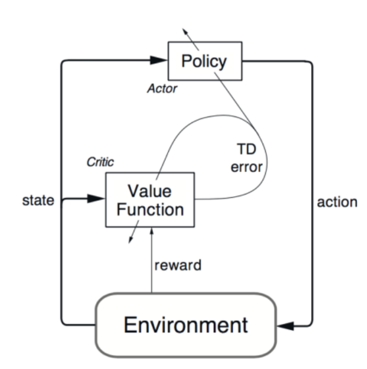
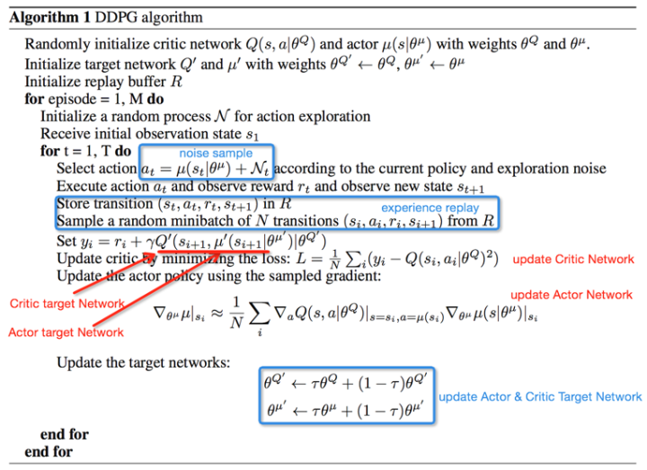

[TOC]

# DDPG

## DQN

QLearning  -->  状态太复杂  -->  利用神经网络处理复杂状态

DQN可以应对高维输入，而对高维的动作输出则束手无策。

DQN可以将高维输入导入神经网络，然后通过训练神经网络选取特定的输出，（使用softmax方法来选取输出）

#### DQN解决问题使用的方法

1. **使用Q-learning 的思想去解决问题**：构造Q-table，然后根据Q-table去选取动作（*适合走迷宫？*）。在DQN中，训练了一个神经网络`eval_net`，使用这个网络去预测给定observation 所对应的action
2. **根据 reward 训练网络**:

### 关键技术

#### 1. experience reply

样本池技术是先将采集到的样本放入样本池，然后从样本池中随机选取样本进行训练，使样本相互独立。在训练中不断选取新的数据来更新样本池。

*思考：DQN是否可以处理特定动作序列的数据？*

#### 2. Fixed Q-targets（Separate Target Network）

使用更新较慢的一个网络专门提供Q值

在DQN的Qtable更新公式中：
$$
Q^*(s,a) = Q(s,a) + \alpha (r + \gamma*\max_{a'	}Q(s',a') - Q(s,a))
$$

### Advanced

#### 1. Prioritized replay

基于优先级的replay机制，replay加速训练过程，这个replay权重还是和DQN error（下图）有关
$$
DQN error = \left|r+\gamma \max _{a^{\prime}} Q\left(s^{\prime}, a^{\prime}, \mathbf{w}^{-}\right)-Q(s, a, w)\right|
$$

#### 2. Double Q-Network

#### 3. Dueling network

仿照Double Q-learning，一个Q网络用于选择动作，另一个Q网络用于评估动作，交替工作，解决upward-bias问题，效果不错。

---

## Policy Gradient

### Basic Components of RL

唯一能做的是调整 Policy of Actor

### PG思想

利用概率选取动作：好action -> 增强概率

#### Trajectory 

参数$\theta$ 时动作$\tau$ 发生的概率
$$
p_\theta 
= p(s_1)p_\theta(a_1| s_1)...\\\
= p(s_1)\prod_{t=1}^{T}p_\theta(a_t|s_t)p(s_{t+1}|S_t,a_t)
$$

#### Reward

**优点**：

- 连续的动作空间（或者高维空间）中更加高效;

- 可以实现随机化的策略；

- 某种情况下，价值函数可能比较难以计算，而策略函数较容易。

  

**缺点**：

- 通常收敛到局部最优而非全局最优
- 评估一个策略通常低效（这个过程可能慢，但是具有更高的可变性，其中也会出现很多并不有效的尝试，而且方差高

#### Using gradient descent to maximize expected reward

$$
\nabla \bar{R_\theta} =  \sum R(\tau) p_\theta (\tau) \frac{\nabla p_\theta(\tau)}{p_\theta(\tau)}\\\
=\frac{1}{N}\sum_{n=1}^{N}\sum_{t=1}^{T_n} R(\tau^n)\nabla log p_\theta(a^n_t| s^n_t)
$$

### Implementation

consider it as a classification problem

minimize cross-entropy == maximize log function

Reward in the whole game instead an episode.

*TIP*

1. Add a Baseline
   It is possible that $R(\tau ^n)$ is  always positive.
   expect reward not always positive --> $R(\tau^n) - b$  $b = E[R(\tau)]$
2. Assign Suitable Credit
   - 为防止action之间互相影响，引起某个action的判断失误。不把整场游戏，而是一部分游戏的reward，来寻找某个action的真正contribution
   - 比较未来的reward做discount
   - Advantage Function: How good it is if we take $a_t$ other than other actions at $s_t$ , estimated by "critic"

## DDPG

### Components

#### Actor-critic 

#### DPG

确定性策略梯度的计算公式和证明

#### DQN

DDPG中借鉴了DQN的experience replay和target network。target network的具体实现与DQN略有不同，DDPG论文中的actor和critic的两个target network以小步长滞后更新，而非隔C步更新

#### Noise sample

连续动作空间的RL学习的一个困难时action的探索。DDPG中通过在action基础上增加Noise方式解决这个问题。

### Algorithm

