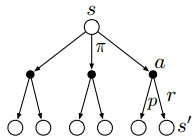

# Q-learning

精髓：
$$
Q(s,a) \leftarrow Q(s,a) + \alpha [ r + \max_{a'} Q(s',a') - Q(s,a)]
$$

## 公式推导

Goal:    $ \max E[\sum_{t=0}^ H  \gamma^t R(S_t, A_t,S_{t+1})|\pi]$

> Qlearning的主要优势就是使用了时间差分法TD（融合了蒙特卡洛和动态规划）能够进行离线学习, 使用bellman方程可以对马尔科夫过程求解最优策略

*To be continued*

### Off-policy & On-policy

TD方法的两种衍生算法：Q-Learning (Off-policy) 和 SARSA (On-policy)

首先区分：Behavior Policy & Target Policy

- Behavior Policy 用来与环境互动产生数据，训练中决策 
  **Exploration**
- Target Policy 用来把Behavior Policy 的数据不断学习优化，然后运用
  **Exploitation**

On-policy 两个策略是同一个策略，虽然简单粗暴（是不是速度会很快？），但是陷入局部最优

Off-policy 将两者分开，虽然相对慢，但是可以达到全局最优，难点？如何优化？

#### 数学推导

**<https://www.zhihu.com/question/57159315/answer/465865135>**

## 其它

写两个方程：

agent 的目标是最大化未来累计预期回报(cumulative expected future reward(with discount factor $\gamma$))

$Q(\mathbf{s}, \mathbf{a} ; \pi)​$ 代表动作价值，对在某状态下某动作的价值大小做一个评估
$$
Q(\mathbf{s}, \mathbf{a} ; \pi)=\mathbb{E}\left[\sum_{t=0}^{\infty} \gamma^{t} R\left(\mathbf{s}_{t}\right) | \mathbf{s}_{0}=\mathbf{s}, \mathbf{a}_{0}=\mathbf{a}, \pi\right]
$$

>  这里还有一个状态价值，代表某状态下的价值大小
> $$
> v_{\pi}(s)=\mathbb{E}_{\pi}[G_{t} | S_{t}=s]
> $$
> 区别应该是体现在用途以及算法上
>
> 比如对于离散型的动作空间，可以单纯基于动作Q值去寻优（DQN算法）
>
> 如果是动作空间巨大或者动作是连续型的，那么可以判断状态价值并结合策略梯度来迭代优化（AC算法）
>
> 

因此用期望代替了policy dynamics（这就是value-based的原因？）

在每个transition处，可以使用Bellman equation 去计算Q
$$
Q\left(\mathbf{s}_{t}, \mathbf{a}_{t} ; \pi\right)=R\left(\mathbf{s}_{t}\right)+\gamma \mathbb{E}\left[Q\left(\mathbf{s}_{t+1}, \mathbf{a}_{t+1} ; \pi\right)\right]
$$

#### 如何使用bellman equation 去选择最优子结构？

<https://www.zhihu.com/search?type=content&q=bellman%20equation>

将状态值和动作值函数分解成瞬时回报加后续折扣：
$$
V_{\pi}(s)=\mathbb{E}_{\pi}\left[R_{t+1}+\gamma V_{\pi}\left(S_{t+1}\right) | S_{t}=s\right]
\\
Q_{\pi}(s, a)=\mathbb{E}_{\pi}\left[R_{t+1}+\gamma Q_{\pi}\left(S_{t+1}, A_{t+1}\right) | S_{t}=s, A_{t}=a\right]
$$

根据上图，可以得到如下关系：以$\pi(a|s)$为权重，动作值函数加权后等于状态值函数（关键点）
$$
V_{\pi}(s)=\sum_{a \in \mathcal{A}} \pi(a | s) Q_{\pi}(s, a)
\\
Q_{\pi}(s, a)=R_{s}^{a}+\gamma \sum_{s^{\prime} \in \mathcal{S}} \mathcal{P}_{s s^{\prime}}^{a} V_{\pi}\left(s^{\prime}\right)
$$
联立之后可以得到：
$$
V_\pi(s) = \sum_{a \in \mathcal{A}} \pi(a|s) ( R_s^a + \gamma \sum_{s^\prime \in \mathcal{S}} \mathcal{P_{ss^\prime}^a} V_\pi(s^\prime))
\\
Q_\pi(s,a) = R_s^a + \gamma \sum_{s^\prime \in \mathcal{S}} \mathcal{P}_{ss^\prime} ^ a \sum_{a \in \mathcal{A}} \pi(a | s) Q_{\pi}(s', a')
$$
最优状态下，找到最优策略使值函数最大的policy（动作值和状态值）
$$
V_*(s) = \max( R_s^a + \gamma \sum_{s^\prime \in \mathcal{S}} \mathcal{P_{ss^\prime}^a} V_*(s^\prime))
\\
Q_*(s,a) = R_s^a + \gamma \sum_{s^\prime \in \mathcal{S}} \mathcal{P}_{ss^\prime} ^ a \max Q_*(s', a')
$$
现在再看Q-Learning的更新式，其实就是使用Bellman Optimality Equation 去更新我们的Q：
$$
Q(s,a) \leftarrow Q(s,a) + \alpha [ R_s^a + \max_{a'} Q(s',a') - Q(s,a)]
$$
$R_s^a + \max_{a'} Q(s',a') $ 是我们目前估计出的理想的Q

