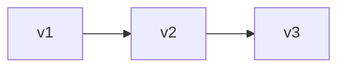
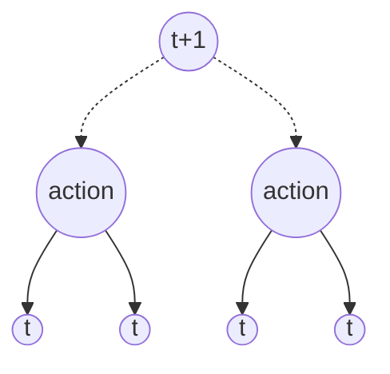
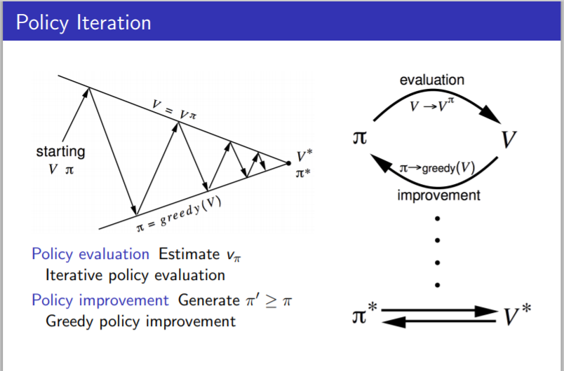

[TOC]

# Dynamic Programming

## Introduction

> **Dynamic **: Sequential or temporal component to the problem
>
> **programming** :  Optimizing a program

Break down to sub-problems --> solve --> optimal

- Optimal substructure

  - decompose --> simple pieces --> take them together

- Overlapping subproblems

  - recur
  - solution cached and reused

- MDP satisfy both properties

  - Bellman equation 

    - > how to break down the optimal function into two pieces, optimal of this step and the optimal after that step

    - Decomposition   recursive

  - Value function

    - stores and reuse

  

  Assumes full knowledge of the MDP

  **used for planning in an MDP**

  - for prediction
    - Input: MDP and $\pi$
    - Output: value function $v_\pi$
  - for control
    - Input: MDP
    - Output: optimal value function and policy

  

## **Policy** Evaluation

Problem : evaluate a given policy

**Bellman expectation equation**

*synchronous backups*

$$
\begin{aligned} v_{k+1}(s) &=\max _{a \in \mathcal{A}}\left(\mathcal{R}_{s}^{a}+\gamma \sum_{s^{\prime} \in \mathcal{S}} \mathcal{P}_{s s^{\prime}}^{a} v_{k}\left(s^{\prime}\right)\right) \\ \mathbf{v}_{k+1} &=\max _{a \in \mathcal{A}} \mathcal{R}^{a}+\gamma \mathcal{P}^{a} \mathbf{v}_{k} \end{aligned}
$$

 

present <-- previous + probability * reward

**how to find optimal policy**

iterate bellman equation again and again

## Policy Iteration

How to make a policy better?

- evaluate the policy $v_{\pi}(s)=\mathbb{E}\left[R_{t+1}+\gamma R_{t+2}+\ldots | S_{t}=s\right]$
- improve the policy  $\pi^{\prime}=\operatorname{greedy}\left(v_{\pi}\right) ​$

converge to optimal policy:

> only 1 optimal state for MDP

value --> greedy --> value --> greedy

## Value Iteration

## Extension to Dynamic Programming

## Contraction Mapping(Why to do that?)

